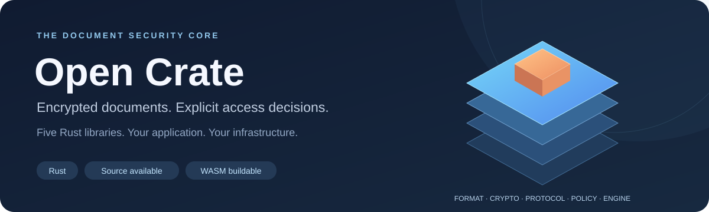
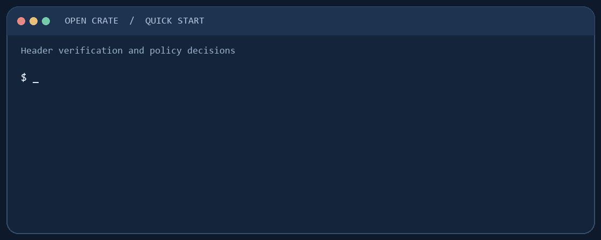

<p align="center">
  
</p>



<p align="center">
  <a href="https://github.com/AlexiAxAxA/OpenCrate/actions/workflows/ci.yml"></a>
  <a href="LICENSE"></a>
  <a href="https://crates.io/crates/opencrate"></a>
</p>

<div align="center">

[Get started](docs/getting-started.md) · [Documentation](docs/index.md) · [Examples](examples/README.md) ·
[Architecture](docs/architecture.md) · [Security](SECURITY.md) ·
[Licensing](docs/licensing.md) · [Website](https://closecrate.com/)

</div>

Open Crate gives Rust applications the building blocks for encrypted documents:
signed headers, authenticated chunks, recipient key slots and explicit access
decisions. It is the five-library core behind Close Crate.

For a Rust project, add the `opencrate` facade to use all five libraries, or
depend on the individual `oc-*` crates you need. The facade is version
`0.0.3`; the five core libraries are also `0.0.3` on crates.io:

```toml
[dependencies]
opencrate = "=0.0.3"
```

Your application supplies storage, transport, keys, secure randomness and time.
The core handles the container rules, cryptography and policy evaluation.
The default core remains buildable for WebAssembly.

## Quick Start

With Git and Rust installed, clone the repository and run a policy example:

```sh
git clone https://github.com/AlexiAxAxA/OpenCrate.git
cd OpenCrate
cargo run --locked -p oc-policy --example access-policy
```

It prints an allowed view with obligations, a denied print, and a view denied
after the lease window. This example uses synthetic facts; your application
must verify its own inputs and enforce the returned obligations. The first
Cargo build downloads dependencies and may take more than a minute. No account
or server is needed. See the [getting started guide](docs/getting-started.md)
for prerequisites and a signed-header check.



## Files beyond `.cc`

Enable the host-side `app-data` feature to seal the bytes of a file of any
extension, or JSON and messages, for one recipient. It re-exports the separate
[`opencrate-sdk`](https://crates.io/crates/opencrate-sdk) as
`opencrate::app_data`; it does not change the `.cc` format.

```toml
[dependencies]
opencrate = { version = "=0.0.3", features = ["app-data"] }
```

```sh
cargo run --locked -p opencrate --features app-data --example seal-file -- README.md
```

The example reads a file as bytes and round-trips it with a temporary key.
The SDK accepts up to **16 MiB** of input, uses OS randomness, and produces an
`OCSB1` envelope rather than a `.cc` document. Your application owns persistent
key protection, storage and public-key authentication. This feature has no
lease, access policy or revocation; see the
[SDK integration guide](https://github.com/AlexiAxAxA/OpenCrateSDK/blob/main/docs/usage-guide.md).

## What you can build

| Your project | What Open Crate contributes |
| --- | --- |
| A document viewer with controlled access | Verify headers and chunks, then evaluate view, print, clipboard and export permissions |
| A document packaging pipeline | Plan recipient slots and assemble authenticated headers around encrypted content |
| A verifier or inspection tool | Check container authenticity and integrate your own author trust store |
| An access-control integration | Process signed lease/revocation messages and evaluate time, device and policy facts |
| Small arbitrary file or application value | Opt into `app-data` for a one-recipient sealed-byte envelope outside `.cc` |

These are integration building blocks. Your application enforces the returned
decisions and obligations. Start with the Quick Start above, then follow the
[integration guide](docs/getting-started.md).

## What is included

| Library | Responsibility |
| --- | --- |
| `oc-format` | Container layout, parsing and authenticated header verification |
| `oc-crypto` | AEAD, key derivation, signatures, key encapsulation and integrity trees |
| `oc-protocol` | Signed leases, revocation and other protocol message codecs |
| `oc-policy` | Access decisions from policy and verified caller-provided facts |
| `oc-engine` | Packing plans, per-file secrets and header assembly |

## Designed to be checked

- Frozen known-answer vectors and golden headers accompany the implementation.
- First-party core crates forbid unsafe Rust. Third-party dependencies have
  their own implementations and assurance boundaries.
- Policy defaults to denial; the application must enforce every obligation.
- Hybrid key slots support ML-KEM-768 with X25519 or P-256. Hybrid protection is
  selected per slot; it does not make every signature or access path quantum-safe.

## Integration status

Pre-release libraries with frozen test vectors and an evolving Rust API.
Pin a reviewed commit in your integration. Container compatibility is documented
in [Architecture](docs/architecture.md#format-compatibility); the threat boundaries
and independent-audit status are in [Security](SECURITY.md).

The application owns key protection and enforcement. Revocation controls future
authorized access within the configured lease/offline windows; it cannot recall
plaintext already extracted by a recipient.

The guides, complete specifications and API documentation are available in English.
See [the documentation map](docs/index.md) for examples and library references.

## License

Open Crate is licensed under [MPL-2.0](LICENSE). Commercial use is allowed;
distributed changes to covered files stay under MPL-2.0. Separate application
files can use other terms. See
[licensing](docs/licensing.md) for release history and third-party terms.

## Support the project

Open Crate is built by one independent developer. If the core is useful to you,
a tip helps keep it going. Tips are voluntary: they are not a license fee, do
not create any support obligation.

| Asset | Network | Address |
| --- | --- | --- |
| USDT | **TRON (TRC20) only** | `TR8Tj4kJ8v75hKrtHgFBg9eodt8CriFhpk` |

Send only USDT on the TRON (TRC20) network to this address. Other tokens or
other networks (Ethereum, BNB Chain and so on) will be lost. No memo or tag is
needed.

## Feedback

Questions and improvement ideas are welcome in
[Issues](https://github.com/AlexiAxAxA/OpenCrate/issues).
Please report security vulnerabilities through [private reporting](SECURITY.md).
If Open Crate helped you, please consider
[starring the repository](https://github.com/AlexiAxAxA/OpenCrate).
It helps others find the project.
