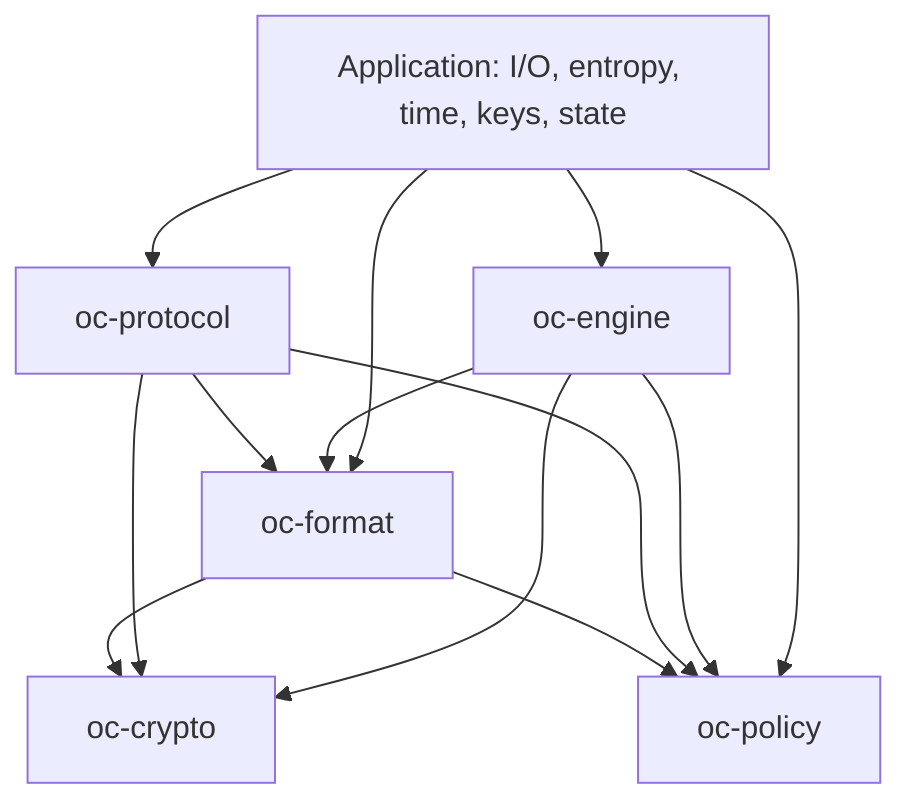

# Architecture

[Documentation](index.md) · [Document lifecycle](how-it-works.md) · [Examples](../examples/README.md)

Open Crate's five libraries share an explicit boundary with the application.

## Library dependencies

`oc-policy` has no package dependencies. `oc-format` verifies cryptographic
authenticity inside parsers where required, so unverified data is not released
between separate parsing and authentication steps. Protocol documents depend
on the container layer; container parsers do not depend on the protocol layer.

The application supplies a cryptographically secure random generator, author
trust policy, device identity, trustworthy time, durable anti-replay state,
network transport and resource limits. The packing engine does not own the
author's signing key. The author signs the transcript of the final header.

The `opencrate` facade optionally re-exports the separate `opencrate-sdk` as
`app_data`. This host-side layer uses OS randomness to seal arbitrary bytes
into `OCSB1` envelopes. It is outside the five-library core and outside the
`.cc` format; the default facade and core retain their WASM build. Applications
using `app-data` own keys, storage, transport and any access rules.
The SDK itself depends on `oc-crypto`: applications that need control of the
random source, key schedule or container orchestration can continue using the
individual low-level libraries. None of those APIs restrict a filename or
extension; `oc-format` specifically parses and builds `.cc` containers.

## Format compatibility

The magic is `CLOSECR1`, the extension is `.cc`, and current containers use version
5. Domain labels use `CC/v1/`; their string version is not the container version.
Versions 1–4 are rejected. Frozen fixtures must not be regenerated to conceal a
regression. Any intentional wire change needs a version decision and matching
specification, vectors and compatibility policy.

No-I/O does not mean `no_std`. WASM compilation is a portability check, not proof
of every purity property and not a browser product. Source checks and dependency
review remain necessary. Test-only filesystem access loads committed fixtures.
