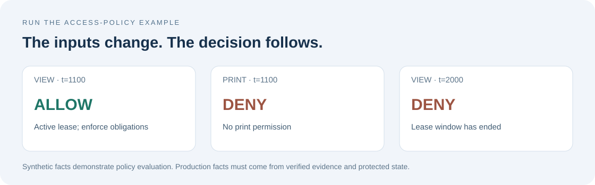

# Getting started

[Documentation](index.md) · [How it works](how-it-works.md) · [Examples](../examples/README.md)

Start by verifying a document header and exploring an access decision. Then
use the same policy example in a separate Rust application.

## 1. Get the source

Install Git and Rust through rustup. The checked-in toolchain file selects the
Rust version and components; rustup downloads them on the first Cargo command.
On Windows, use the MSVC Rust toolchain with the Visual Studio C++ build tools.

```sh
git clone https://github.com/AlexiAxAxA/OpenCrate.git
cd OpenCrate
```

The commands below run from this directory unless stated otherwise. The first
build needs internet access to download the toolchain and dependencies. No
Open Crate account, license server or hardware security module is needed for
these examples.

## 2. Verify a header

```sh
cargo run --locked -p oc-format --example verify-header -- tests/golden/basic.cc
```

Expected output:

```text
Header signature verified. Author is UNKNOWN: pin a verified identity before granting access.
```

This authenticates the committed header. `UNKNOWN` is the expected result: the
example has an empty trust store. Your application must establish which author
identities it trusts before granting access. This example checks the header;
it does not decrypt or authenticate every payload chunk.

Try a negative control using a file that is not a container:

```sh
cargo run --locked -p oc-format --example verify-header -- Cargo.toml
```

Expected: `header authentication failed` and a nonzero exit code. The example
must reject it. The command reads the file without modifying it.

## 3. Explore access decisions



```sh
cargo run --locked -p oc-policy --example access-policy
```

The [complete example](../crates/oc-policy/examples/access-policy.rs) starts with
a deny-by-default policy and grants viewing. It uses synthetic lease, device,
hash and time values to show three outcomes:

| Request | Expected result | Why |
| --- | --- | --- |
| View at time 1100 | Allow, with obligations | The device and policy match an active lease |
| Print at time 1100 | Deny | Printing was never granted |
| View at time 2000 | Deny | The lease/offline window has ended |

The program returns an error if any expected outcome changes. Inspect the
obligations printed with `ALLOW`: the application must implement them before
serving plaintext. These synthetic facts illustrate the decision API; they
are not a production lease issuer or proof of a device's identity.

## 4. Use it in your own application

From inside `OpenCrate`, create a sibling project:

```sh
cd ..
cargo new policy-demo
cd policy-demo
cargo add oc-policy --path ../OpenCrate/crates/oc-policy
```

Replace `src/main.rs` with the working example. In PowerShell:

```powershell
Copy-Item ../OpenCrate/crates/oc-policy/examples/access-policy.rs src/main.rs
cargo run
```

Or in Bash:

```sh
cp ../OpenCrate/crates/oc-policy/examples/access-policy.rs src/main.rs
cargo run
```

You should see the same three outcomes. This application consumes a path
dependency from the exported repository. Keep its generated `Cargo.lock` for
reproducible builds.

## Choose the libraries for your integration

The five libraries and the `opencrate` facade are published to crates.io at
`0.0.2`. To use the full core, add one dependency:

```toml
[dependencies]
opencrate = "=0.0.2"
```

The facade re-exports the libraries as `opencrate::{crypto, engine, format,
policy, protocol}`. To depend on only the libraries you use, declare them
individually instead:

```toml
[dependencies]
oc-format = "=0.0.2"
oc-crypto = "=0.0.2"
oc-protocol = "=0.0.2"
oc-policy = "=0.0.2"
oc-engine = "=0.0.2"
```

To seal arbitrary application bytes or a small file without a `.cc` container,
enable `app-data` on the facade. This optional feature re-exports the separate
`opencrate-sdk` as `opencrate::app_data` and requires a native OS random source.
The [file example](../crates/opencrate/examples/seal-file.rs) reads any file
extension up to 16 MiB; it does not save a key or envelope for later use.

```toml
[dependencies]
opencrate = { version = "=0.0.2", features = ["app-data"] }
```

For persistent application data, follow the
[SDK key and storage guide](https://github.com/AlexiAxAxA/OpenCrateSDK/blob/main/docs/usage-guide.md).

The pinned Rust toolchain for this repository is in `rust-toolchain.toml`.
For local source development, use path dependencies and pin a reviewed source
revision and lockfile in your integration:

```toml
[dependencies]
oc-format = { path = "../OpenCrate/crates/oc-format" }
oc-crypto = { path = "../OpenCrate/crates/oc-crypto" }
oc-protocol = { path = "../OpenCrate/crates/oc-protocol" }
oc-policy = { path = "../OpenCrate/crates/oc-policy" }
oc-engine = { path = "../OpenCrate/crates/oc-engine" }
```

Committed fixtures use public test inputs. Never reuse their keys in an application.

## Recipient integration

1. Bound input sizes before allocating. Authenticate the header with
   `oc_format::verify::verify_and_parse`; require an appropriate `SignerTrust`.
2. Select a supported recipient slot and validate the target device binding.
3. Verify the lease signature, then decode the lease. Bind it to the same file,
   policy, authority and device. Apply current revocation evidence.
4. Populate `oc_policy::Context` from verified state. Protect sequence numbers,
   counters and time floors from replay and rollback.
5. Call `oc_policy::evaluate`. Enforce both the verdict and its obligations;
   deny access if your application cannot implement an obligation.
6. Authenticate each chunk before exposing its plaintext. Reevaluate expiration
   and revocation during a session, and clear sensitive buffers on failure.

The core does not provide `open(path)`. A complete recipient application must
implement this orchestration, transport and persistent state.

## Packing integration

Choose valid public keys and policy; validate chunk size with
`oc_format::check_chunk_size`. Call `oc_engine::plan` with caller-provided secure
entropy. Stream encryption according to the format, construct `SealedInfo` from
the actual output, and consume the session with `Session::assemble`. Derive and
sign the transcript from the final header bytes. Publish the completed file
atomically in the host application.

Keep the request consistent across planning and assembly. Treat `Session` and
`Plan` as sensitive. Use the existing nonce, AEAD and key-derivation APIs; do not
replace them with an apparently equivalent construction. Test-only features
`explicit-nonce`, `test-signer` and `ad-hoc-label` are not production defaults.

## Validate your integration

Test valid and wrong recipients, damaged signatures/MACs/chunks, mismatched and
expired leases, replay, clock rollback, network loss, restart and old-state
restoration. Test fail-closed enforcement of obligations. An author-only success
does not validate the recipient path. Check output against an independent reader.

Build the API reference with `cargo doc --locked --workspace --no-deps`.
The complete English [format](format.md) and [protocol](protocol.md) specifications
are included. See [translation notes](translation-notes.md) for literal examples
and the relationship between historical decisions and later amendments.

## Troubleshooting

| What you see | What to check |
| --- | --- |
| Repository not found or authentication required | Check the public repository URL and network access |
| `cargo` or the Windows linker is missing | Install rustup and, on Windows, the C++ build tools; reopen the terminal |
| Toolchain or dependency download fails | Check network access to the Rust distribution service and crates.io; do not change the pinned version to hide the failure |
| File not found for the fixture | Run the command from the `OpenCrate` repository root |
| Author is `UNKNOWN` | Expected for the empty example trust store; configure trusted author keys in your application |
| A policy request is denied | Check the action, device fingerprint, policy hash, lease validity and persisted replay state |
| An allowed action includes obligations | Implement those obligations before delivering content; the library does not control your UI |

From the repository root, run `cargo test --locked --workspace` for the full
suite and `cargo doc --locked --workspace --no-deps --open` for the API reference.
