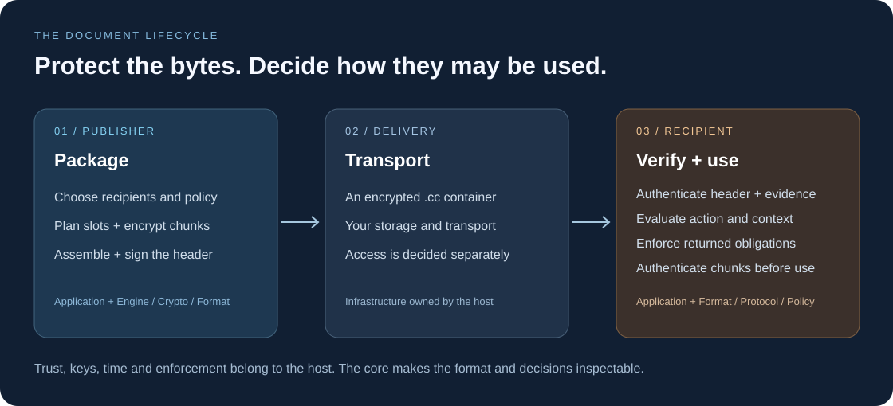

# A document's journey

[Documentation](index.md) · [Getting started](getting-started.md) · [Architecture](architecture.md)

Open Crate separates the bytes of a protected document from the decision to
use them. A signed header describes the container and recipients; authenticated
chunks hold its encrypted content. Policy evaluation decides whether a requested
action is allowed using facts supplied by the application.



## Package

The publisher chooses recipients, algorithms and a policy. The application
supplies secure randomness and calls `oc-engine` to plan the key material and
recipient slots. It encrypts content through the crypto APIs, then assembles
and signs the final header with the author's signing key.

The host streams input and output and publishes the completed file atomically.
The packing engine is not the owner of the author's private signing key.

## Deliver

The encrypted `.cc` container can travel through the application's storage and
transport. Those facilities are outside the core. Transporting the bytes does
not grant the recipient access or establish the author's identity.

## Verify and decide

The recipient application bounds its input sizes and authenticates the header.
It establishes author trust, selects the appropriate recipient path, verifies
the required signed protocol evidence and checks its bindings to the file,
device and policy.

`oc-policy::evaluate` receives an action, a policy, lease facts and context. It
returns either a denial reason or permission with obligations. The application
enforces the result, authenticates content chunks before exposing plaintext,
and maintains the time, counters and replay state needed for future decisions.


Run the [access-policy example](../crates/oc-policy/examples/access-policy.rs)
to reproduce these three outcomes:

```sh
cargo run --locked -p oc-policy --example access-policy
```

The example uses synthetic facts so you can see the decision independently of
networking or hardware. A real integration obtains those facts from authenticated
data and trusted application state. An `ALLOW` result is conditional on enforcing
its obligations; the example prints them rather than displaying a real document.

## Keep checking

Expiry, revocation and device conditions can change during a session. The host
must re-evaluate access at the required boundaries and protect persisted state
against rollback. Lease/offline windows bound when new revocation evidence
affects access. They do not erase plaintext that was already extracted.

For byte layouts and exact checks, use the [format](format.md) and
[protocol](protocol.md) specifications. For the threat boundary, read
[Security](../SECURITY.md).
