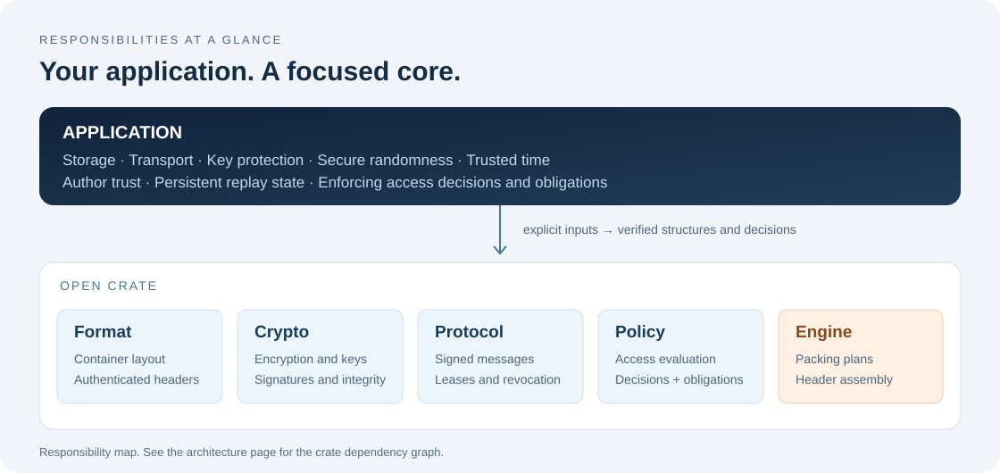

# Open Crate documentation

[Home](../README.md) · [Run the examples](getting-started.md) · [Examples catalog](../examples/README.md)



## Start with a working example

| I want to… | Start here |
| --- | --- |
| Try the core on my machine | [Getting started](getting-started.md) |
| Seal any small file or application value | [Facade `app-data` example](../examples/README.md#seal-a-small-file-of-any-extension) |
| Understand a document's journey | [How it works](how-it-works.md) |
| Choose the crates for my application | [Architecture and responsibilities](architecture.md) |
| Verify a header or explore access rules | [Runnable examples](../examples/README.md) |
| Implement the container format | [Container specification](format.md) |
| Implement protocol messages | [Protocol specification](protocol.md) |
| Report a vulnerability privately | [Security policy](../SECURITY.md) |
| Understand commercial terms | [Licensing](licensing.md) |
| Propose a contribution | [Contributing](../CONTRIBUTING.md) |

## Library references

Each crate has a short introduction beside its source:
[Format](../crates/oc-format/README.md),
[Crypto](../crates/oc-crypto/README.md),
[Protocol](../crates/oc-protocol/README.md),
[Policy](../crates/oc-policy/README.md) and
[Engine](../crates/oc-engine/README.md).

Generate the API reference locally:

```sh
cargo doc --locked --workspace --no-deps --open
```

The specification defines the wire representation. The guides explain how to
integrate the libraries, and the examples demonstrate a deliberately small
path through their APIs. The application is responsible for trusted inputs,
key protection and enforcement.

See [Translation notes](translation-notes.md) for preserved literal examples and
how to read the dated specification history.

See [the 0.0.4 review](review-2026-09-26.md) for reproduced defects, checks and
the scope of the readability changes.
